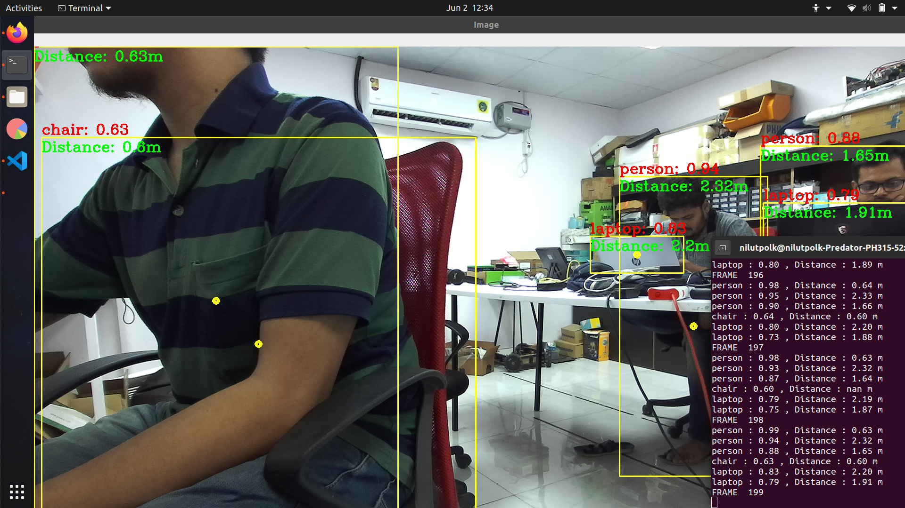

# Stereolabs ZED - YOLO 3D in C++

This package lets you use YOLO, the deep learning object detector using the ZED stereo camera and the ZED SDK C++.

**NOTE** : This package works with YOLO V2, YOLO V3, YOLO V4

The below image will be used to display the detected objects alongside the distance of each, using the ZED Depth.

  

## Prerequisites

- Ubuntu 20.04
- [ZED SDK](https://www.stereolabs.com/developers/) and its dependencies ([CUDA](https://developer.nvidia.com/cuda-downloads))
- [OpenCV](https://docs.opencv.org/4.x/da/df6/tutorial_py_table_of_contents_setup.html) built with CUDA and [cuDNN](https://developer.nvidia.com/cudnn)

## Build and Run the application

### Build the sample with cmake

Go to the sample folder

        cd zed_cpp_sample/

Create a build directory and generate a solution from the CMake

        mkdir build
        cd build
        cmake ..
        make

### Setup the application

- Download the model file, for instance Yolov4

        wget https://github.com/AlexeyAB/darknet/releases/download/darknet_yolo_v3_optimal/yolov4.weights

### Run the sample

To launch the ZED with YOLO simply run the sample, be careful to the path, the folder has to match to find the configuration files and weights file :

        ./build/yolo_zed 

The input parameters can be changed using the command line :

        ./build/yolo_zed <meta> <config> <weight> <svo_file> <threshold>

For instance :

        ./build/yolo_zed coco.names yolov4.cfg yolov4.weights mySVOFile.svo 0.2
        
For running with custom weights :

        ./build/yolo_zed obj.names yolov4-custom.cfg yolov4-custom.weights mySVOFile.svo 0.2
