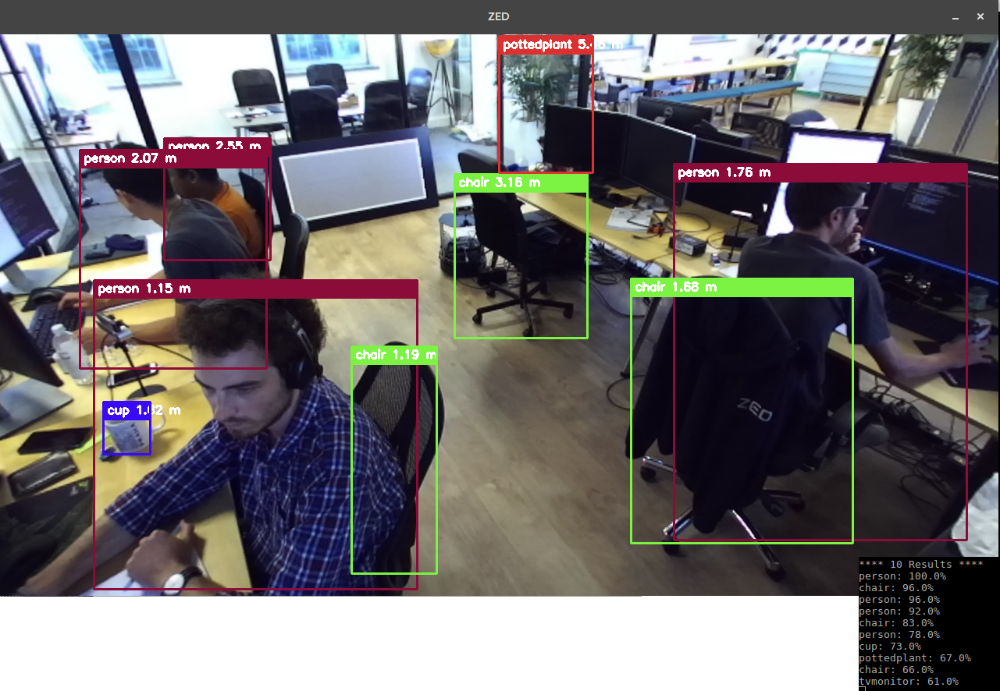

# Stereolabs ZED - YOLO 3D in Python

This package lets you use YOLO the deep learning object detector using the ZED stereo camera in Python 3.

The left image will be used to display the detected objects alongside the distance of each, using the ZED Depth.

  

## Prerequisites

- Windows 7 64bits or later, Ubuntu 16.04
- [ZED SDK](https://www.stereolabs.com/developers/) and its dependencies ([CUDA](https://developer.nvidia.com/cuda-downloads))
- [ZED Python 3 wrapper](https://github.com/stereolabs/zed-python)

## Setup ZED Python

Download and install the [ZED Python wrapper](https://github.com/stereolabs/zed-python) following the instructions, to make sure everything works you sould try a [sample](https://github.com/stereolabs/zed-python/tree/master/examples).

## Setup Darknet

We will use a fork of darknet from @AlexeyAB : https://github.com/AlexeyAB/darknet

- It is already present in the folder libdarknet

- Simply call make in the folder

        cd libdarknet
        make -j4

- For more information regarding the compilation instructions, check the darknet Readme [here](../libdarknet/README.md)

## Setup the application

- Download the model file, for instance Yolov3 tiny

        wget https://pjreddie.com/media/files/yolov3-tiny.weights

## Run the application

To launch the ZED with YOLO simply run the script :

        python3 darknet_zed.py

The input parameters can be changed using the command line :

        python3 darknet_zed.py -c <config> -w <weight> -m <meta> -t <threshold> -s <svo_file>

For instance :

        python3 darknet_zed.py -c cfg/yolov3.cfg -w yolov3.weights -m cfg/coco.data -t 0.5

To display the help :

        python3 darknet_zed.py -h
