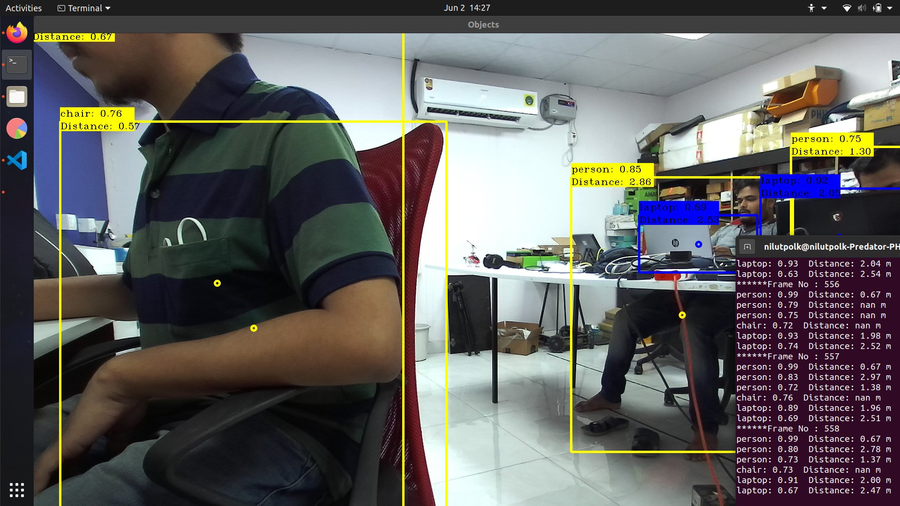

# Stereolabs ZED - YOLO 3D in Python

This package lets you use YOLO the deep learning object detector using the ZED stereo camera in Python 3.

**NOTE** : This package works with YOLO V2, YOLO V3, YOLO V4

The below image will be used to display the detected objects alongside the distance of each, using the ZED Depth.

  

## Prerequisites

- Windows 7 64bits or later, Ubuntu 20.04
- [ZED SDK](https://www.stereolabs.com/developers/) and its dependencies ([CUDA](https://developer.nvidia.com/cuda-downloads))
- [ZED Python 3 wrapper](https://github.com/stereolabs/zed-python)
- [OpenCV](https://docs.opencv.org/4.x/da/df6/tutorial_py_table_of_contents_setup.html) built with CUDA and [cuDNN](https://developer.nvidia.com/cudnn)

## Setup ZED Python

Download and install the [ZED Python wrapper](https://github.com/stereolabs/zed-python) following the instructions, to make sure everything works you sould try a [sample](https://github.com/stereolabs/zed-python/tree/master/examples).

## Setup the application

- Download the model file, for instance Yolov4

        wget https://github.com/AlexeyAB/darknet/releases/download/darknet_yolo_v3_optimal/yolov4.weights

## Run the application

To launch the ZED with YOLO simply run the script :

        python3 zed_yolo.py

The input parameters can be changed using the command line :

        python3 zed_yolo.py -c <config> -w <weight> -m <meta> -s <svo_file> -z <zed_id>

For instance :

        python3 zed_yolo.py -c yolov4.cfg -w yolov4.weights -m coco.names -z 1

To display the help :

        python3 zed_yolo.py -h
